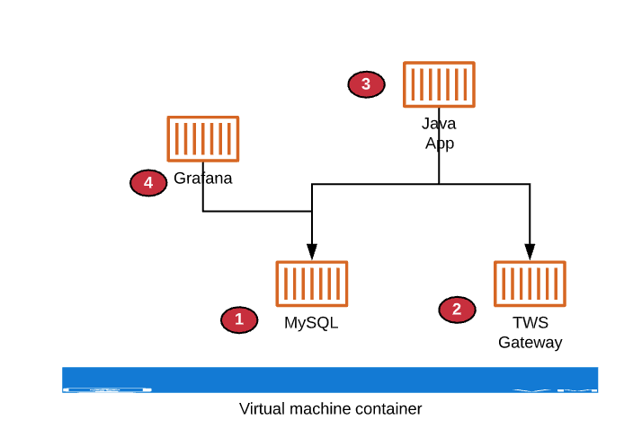

# OptionList3Deploy

Doc to deploy Arbo3 as a docker solution!

This will have 4 containers running.  

##  1. MySQL 5.7 
    
  This must be the 1st container to startup and must always running 

##  2. TWS Gateway
    
  This is the 2nd container to startup and must always be running.
  It needs access to the internet
  It tends to loose connection sometimes and
  It will logoff periodically - either daily (production) or weekly (non-production) depending on the account type

##  3.  Grafana

  This needs access to MySQL to do reporting
  Needs ports 3000 exposed

##  4. MyJava App

  This is a standalone jar file that is executable from 1 command
  It runs for some time (minutes) and stopps
  I need/will run this several times an hour
  It will connect to TWS Gateway (2) to collect data and 
  It will connect to MySQL (1) to store data.

Docker Deployment Architecture Diagram
